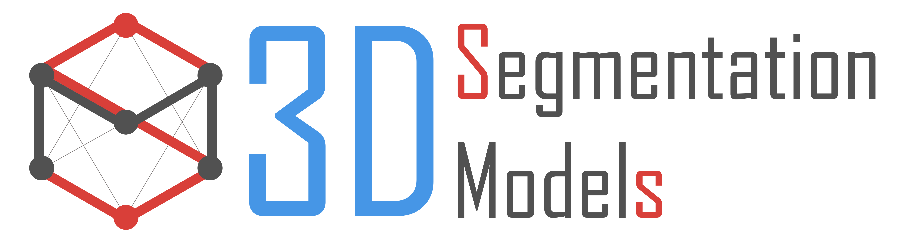

 
  
${\color{red} {\textbf{3D Medical Image Segmentation}}}$ <b>Python Library Segmentation based on [PyTorch](https://pytorch.org/)</b>.

 
 
 
 
 
 
 
 
 

The main features of this library are:

 - High level API (just two lines to create a neural network)
 - 9 models architectures for binary and multi class segmentation (including legendary Unet)
 - All encoders have pre-trained weights for faster and better convergence
 - Popular metrics and losses for training routines
 

### 🛡️ License 
Project is distributed under [MIT License](https://github.com/qubvel/segmentation_models.pytorch/blob/master/LICENSE)
